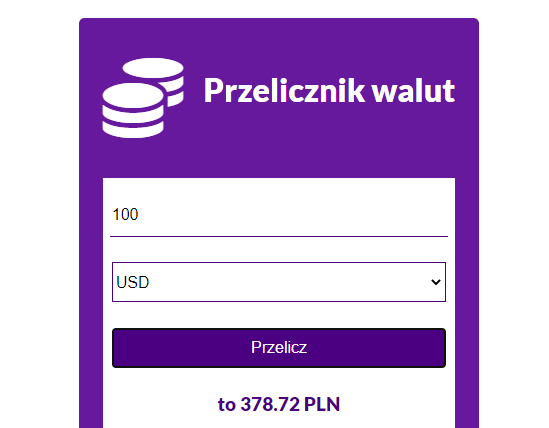
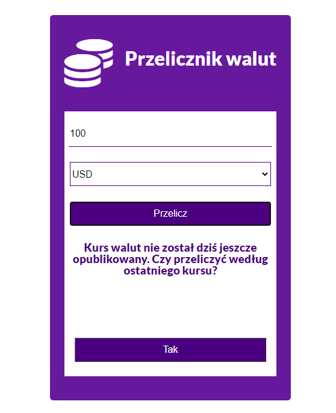

# Currency converter

> Currency converter app based od javascript. This application convert money amount that you put in to PLN.
> The currency rates are taken from today. If they can't find the rates from today they ask you if you want rates from previous day.

## General info

This project was created during my forontend bootcamp. I built this project based on javascript, I want to practis using axios and handling of asynchronous events.

## Demo

Here is a working demo : https://malachowiczmarta.github.io/js_currency_converter/

## Screenshots

## Technologies

- Javascript
- HTML5
- CSS3
